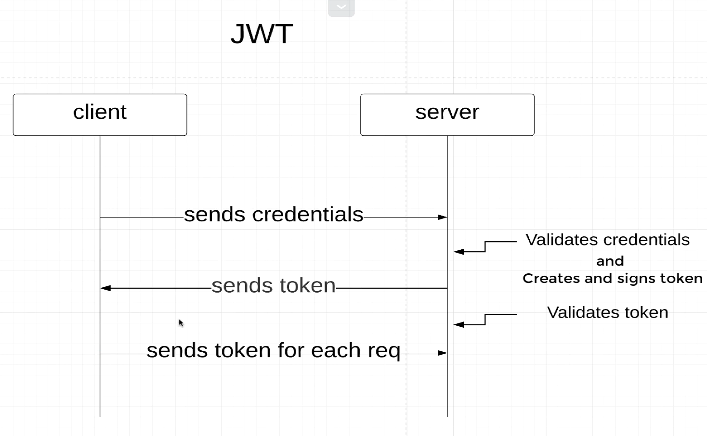
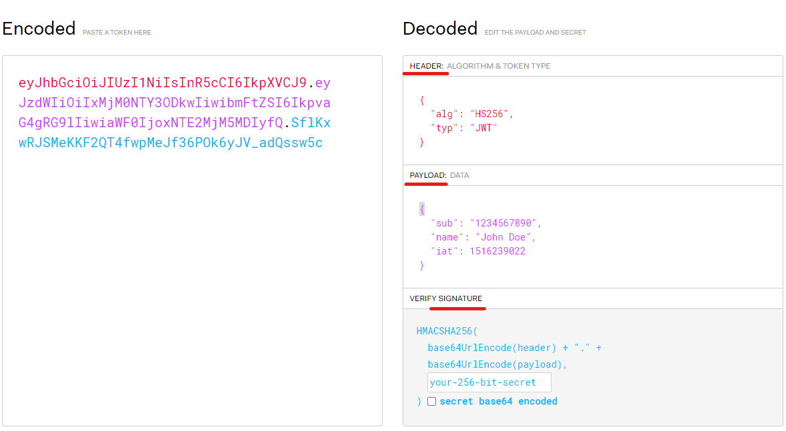

# Full-Restful-API-With- JWT Security

### This is a complete tutorial of building a REST api with Spring Boot with. You will learn how to:
1. Create REST APIs
2. Add spring security with jwt authentication & authorization
3. Work with database
4. Add database migration with flyway

## JWT Security
+ Fast.
+ Stateless: it means it doesn't need to have a Database, but more importent the actual     Session of that current user.  
With JWT you don't have to store the Session because everything is embedded in a Token.
+ Compromised Secret Key.
+ No Visibility to Logged in users.
+ Token can be stolen.

### How Does JWT Works 

### Exmple about JWToken.
[jwt.io](JWT.io)
